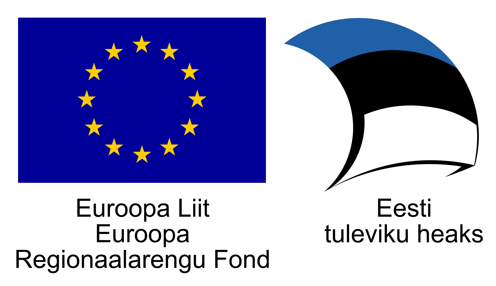
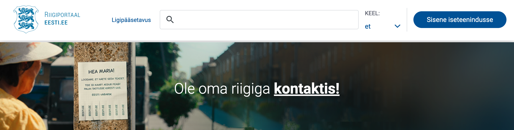
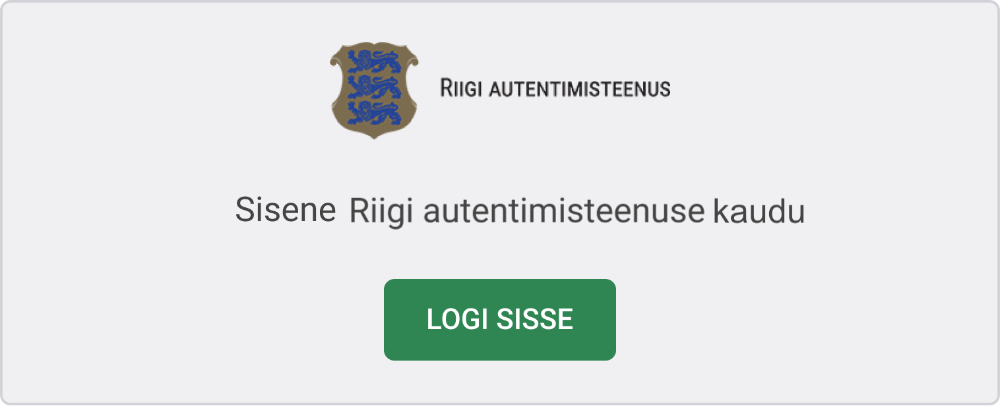

# Ärikirjeldus

Riigi SSO teenus (GovSSO) on Riigi Infosüsteemi Ameti poolt pakutav teenus, millega asutus saab oma e-teenusesse lisada nii siseriiklike kui ka Euroopa Liidu piiriüleste autentimismeetodite toe koos seansihaldusega.

Ülevaate seansihaldusest leiab [siit](https://www.id.ee/artikkel/autentimine-e-teenustes/).

Teenust osutatakse kõigile valitsussektori asutustele vastavalt Rahandusministeeriumi [kodulehel»](https://www.fin.ee/riigihaldus-ja-avalik-teenistus-kinnisvara/riigihaldus/avaliku-sektori-statistika) toodud tabelile (v.a Muu avalik sektor).

Siseriiklikest autentimismeetoditest on toetatud:

- mobiil-ID (ainult Eesti isikukoodiga kasutajad)
- ID-kaart
- smart-ID (ainult Eesti isikukoodiga kasutajad) *Palume pöörata e-teenuste osutajatel tähelepanu asjaolule, et Smart-IDga isiku tuvastamisel ei ole võimalik eristada Eesti residente mitte residentidest (näiteks nagu seda võimaldab e-residentide sertifikaat).*

Samuti on toetatud piiriülene autentimine [Euroopa Liidu teavitatud eID vahenditega](https://ec.europa.eu/cefdigital/wiki/display/EIDCOMMUNITY/Overview+of+pre-notified+and+notified+eID+schemes+under+eIDAS) läbi eIDAS-Node taristu.

## Kellele?

Valitsussektori asutustele, kes soovivad:
- oma e-teenustes pakkuda kasutajatele laia valikut autentimismeetodeid, ise neid meetodeid teostamata.
- lisada oma e-teenusele SSO toe.

## Kes Riigi SSO teenust kasutavad?
Riigi SSO teenusega on liitunud 57 asutust 98 infosüsteemiga, sh Riigiportaal eesti.ee, e-Rahvastikuregister, Riigi Tugiteenuste Keskuse Toetuste register (SFOS), Terviseportaal, Tervisejuhtimise töölaud, Tervisekassa Partnerportaal, PRIA kliendiportaal (ePRIA), Tallinna raielubade andmekogu, Transpordiameti Sõidukite digiregistreerimise keskkond, Keskkonnaotsuste Infosüsteem (KOTKAS), Keskkonnaameti Metsaportaal, Riiklik Postkast, X-tee iseteeninduskeskkond jt.

## Tehnilised tingimused?

E-teenus liidestatakse autentimisteenusega OpenID Connect protokolli kohaselt. Vt lähemalt: [TechnicalSpecification](TechnicalSpecification).

## Kuidas liituda?

Asutusel tuleb:

1 välja selgitada, kas ja millistes e-teenustes soovitakse GovSSO teenus kasutusele võtta 

2 kavandada ja tellida liidestamistöö 

3 teostada arendus 

4 esitada RIA-le taotlus teenusega liitumiseks 

- RIA registreerib teie rakenduse GovSSO teenuse kliendiks ja avab juurdepääsu GovSSO demokeskkonda.

5 testida liidest RIA demoteenuse vastu

- RIA abistab võimalike probleemide lahendamisel

6 eduka testimise järel taodelda registreerimist toodanguteenusega

- RIA avab teie rakendusele juurdepääsu GovSSO toodangukeskkonda.

## Millal?

Testteenus on avatud 2022. a märtsist

Teenus on avatud toodangukeskkonnas augustist 2022.

## Soovitused Riigi SSO teenuse integreerimiseks kliendi teenuses

- kui teenuses on kasutuses üksnes Riigi SSO teenus (GovSSO) või Riigi autentimisteenus (TARA), on soovituslik kasutada viidet “Logi sisse” koos paigutusega veebilehe paremal üleval servas

- ainult eIDAS liidestuse korral on soovituslik kasutada Riigi SSO teenusele suunamiseks viidet “EL riigi eID” / “Other EU country” või kasutada [logo](https://github.com/e-gov/TARA-Login/blob/master/disain/assets/eu_citizen_login_btn_190x50.svg)

 

- kui teenuses on kasutusel Riigi SSO teenuse kõrval ka teisi autentimisvahendeid, kasutada viitena Riigi autentimisteenuse [logo](https://github.com/e-gov/TARA-Login/blob/master/disain/assets/tara_logo.svg) koos selgitusega “Sisene Riigi autentimisteenuse kaudu” või “Sisene läbi Riigi autentimisteenuse”.

  

## Rohkem teavet?

Kontakt: [klient@ria.ee](mailto:klient@ria.ee).

Kui pöördute liidestamisel või liidestatud klientrakenduses GovSSO kasutamise tehnilise probleemiga, siis palume valmis panna väljavõte klientrakenduse logist. Tõrkepõhjuse väljaselgitamiseks vajame teavet, mis päring(ud) GovSSO-sse saadeti ja mis vastuseks saadi.

Samuti tasub heita pilk [korduma kippuvate küsimuste rubriiki](Faq).

Liitumisega seotud info leiab [siit](Application).

[TechnicalSpecification](TechnicalSpecification) (liidese arendajale).
