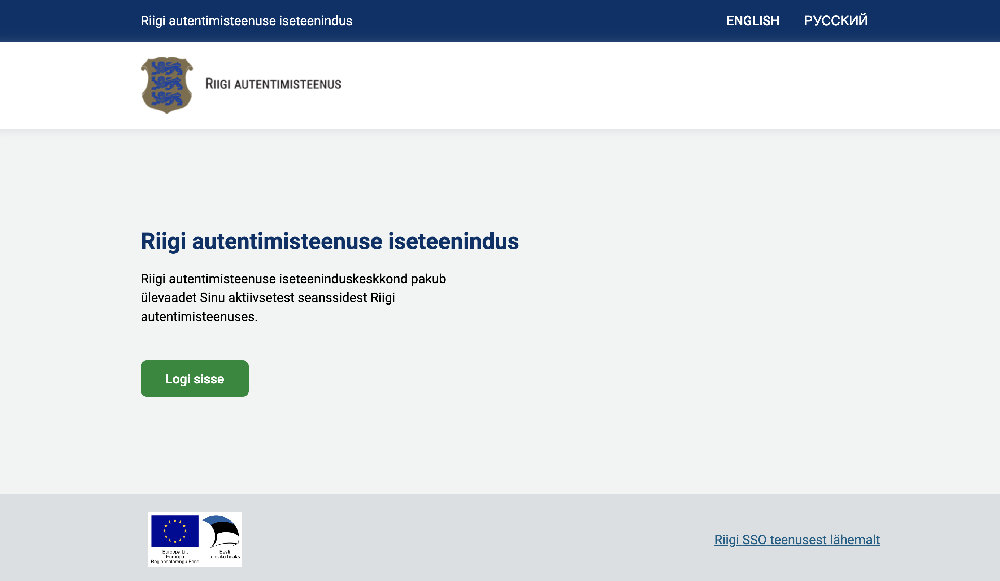

# Riigi autentimisteenuse iseteeninduskeskkond

Riigi autentimisteenuse iseteeninduskeskkond [https://minuautentimine.ria.ee](https://minuautentimine.ria.ee) pakub ülevaadet kasutaja aktiivsetest SSO seanssidest Riigi autentimisteenuses, kus kasutajal on võimalik enda kehtivaid seansse näha ja neid keskselt lõpetada.

Selleks tuleb kasutajal esmalt isikutuvastuseks sisse logida [https://minuautentimine.ria.ee](https://minuautentimine.ria.ee) lehel, mille järel kuvatakse kasutajale nimekiri tema aktiivsetest seanssidest riigi e-teenustes.

Näiteks, kui kasutaja logib ühiskasutavas arvutis sisse mitmesse e-teenusesse ning unustab ennast välja logida, on tal võimalus mistahes seadmes (näiteks mobiiltelefonis) antud seanss lõpetada.

Iseteeninduskeskkonda on kasutajal võimalik liikuda ka riigi autentimisteenuses autentimise, seansi jätkamise ja väljalogimise lehtedel oleva lingi kaudu:

