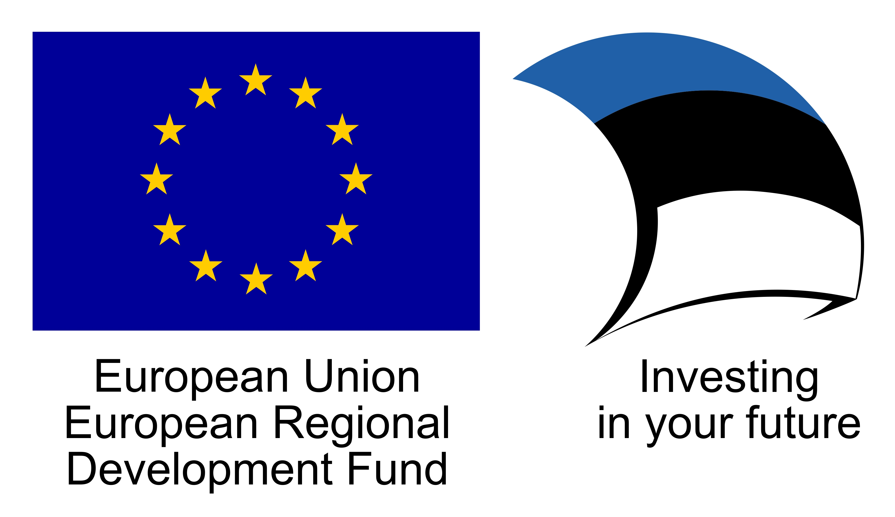

#  Riigi SSO teenus (GOVSSO)

Riigi SSO teenus (tehnilise nimega GOVSSO) on Riigi Infosüsteemi Ameti poolt keskselt osutatav teenus, millega asutus saab oma e-teenuses ühekordse sisselogimisega autentida ID-kaardi, mobiil-ID, smart-ID ja Euroopa Liidu eID kasutaja.

Teenust osutatakse kõigile valitsussektori asutustele vastavalt Rahandusministeeriumi [kodulehel»](https://www.rahandusministeerium.ee/et/riigihaldus) toodud [tabelile»](https://www.rahandusministeerium.ee/sites/default/files/riigihaldus/avaliku_sektori_asutused_asutuse_liikide_loikes_2021.xlsx) (XLSX) (v.a Muu avalik sektor).

Käesoleva lehe teave on mõeldud kolmele sihtrühmale:
1. Asutuse äriüksuse juht saab siinse teabe alusel hinnata GOVSSO sobivust, liidestustööde mahtu ja teha otsuse GOVSSO kasutuselevõtuks;
2. Liidese arendaja leiab siit kogu vajaliku tehnilise teabe asutuse e-teenuste liidestamiseks GOVSSO-ga;
3. GOVSSO edasiarendajale.

Ametlikku teavet GOVSSO ja teiste RIA teenuste kohta leiab [RIA autentimisteenuste lehelt](https://www.ria.ee/et/riigi-infosusteem/eid/partnerile.html#govsso). 

## Ärikasutajale

[Ärikirjeldus](BusinessDescription) · [Liitumine](Application)

## Liidese arendajale

[Tehniline kirjeldus](TechnicalSpecification)

[GOVSSO näidisklient](Example)

[Sõnastik](Sonastik) · [Viited](References) · [Korduma kippuvad küsimused](Faq)

## Riigi SSO teenuse arendajale

[Kood ja arendaja dokumentatsioon](https://github.com/e-gov/GOVSSO-Session)
